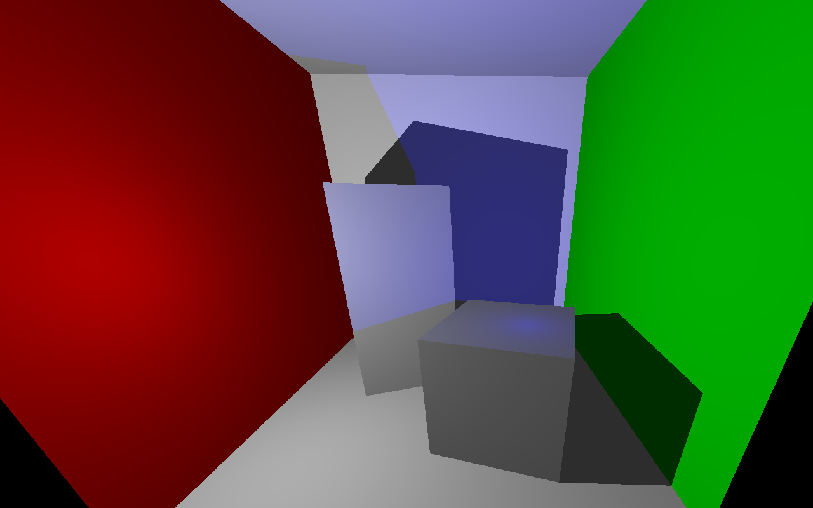
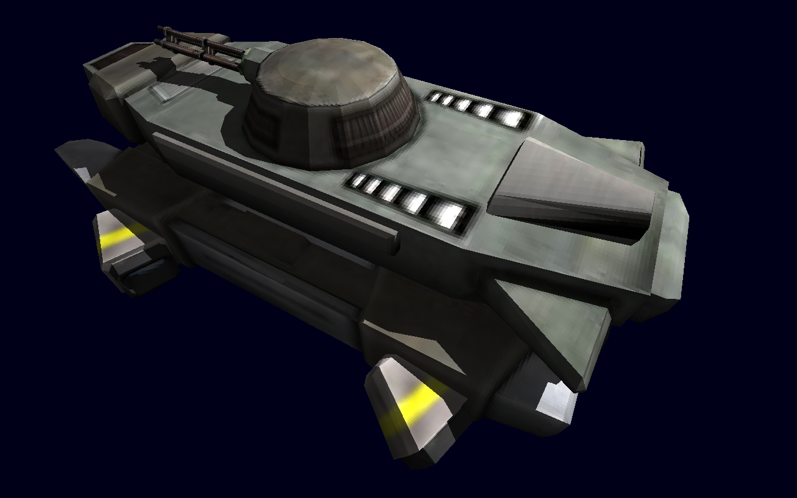
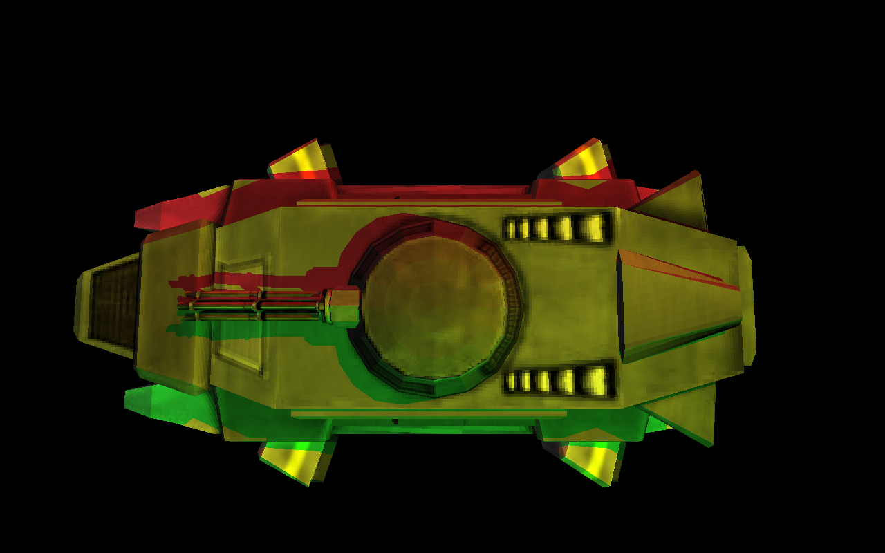
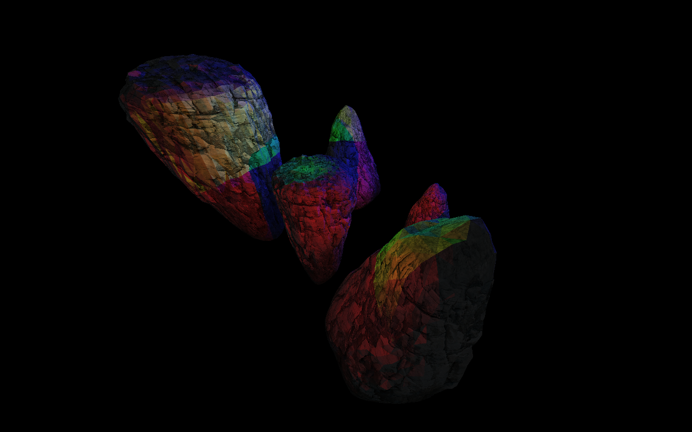

#  LightWelter; yet another raytracer

## Installation

### Dependencies
 - System packages (as named in Debian): libassimp-dev libglew-dev libsdl2-dev libsdl2-image-dev libspdlog-dev cmake
 - OpenGL ES 3.10 capable driver
 - C++14 capable compiler
 - internet connection (cmake will download some other dependencies)

### Installation
```bash
git clone https://github.com/acriaer/light-welter.git
cd light-welter
mkdir build
cd build
cmake -DCMAKE_BUILD_TYPE=Release ..
make -j4
cd ..
```

### Usage
```bash
./build/demo_app <rtc_file> [--<config_option_name>=<config_option_value>]*
```

You should see two windows: one for the opengl preview and one for the raytracer's output image. Press ENTER key to start raytracing. You can alse use some other keys:

 - X -- unlock free camera movement
 - WSADQE -- move the camera around
 - arrow keys -- change camera orientation
 - +/- -- increase/decrease the field of view
 - ESCAPE -- quit

For now please only use "standard" resolutions, i.e. 640x480 instead of 600x400.

### Examples
>./build/demo_app res/view_test/view_test.rtc 


>./build/demo_app res/view_test/cornell.rtc


>./build/demo_app res/view_test/cornell2.rtc



>./build/demo_app res/phoenix/phoenix.rtc



>./build/demo_app res/phoenix/phoenix2.rtc



>./build/demo_app --resx=1280 --resy=800 res/rocks/rocks.rtc (scene not avaliable in the repo)


## Other software used
>http://ogldev.atspace.co.uk/index.html

>https://github.com/opengl-tutorials/ogl

>SDL2pp

>spdlog

>pugixml